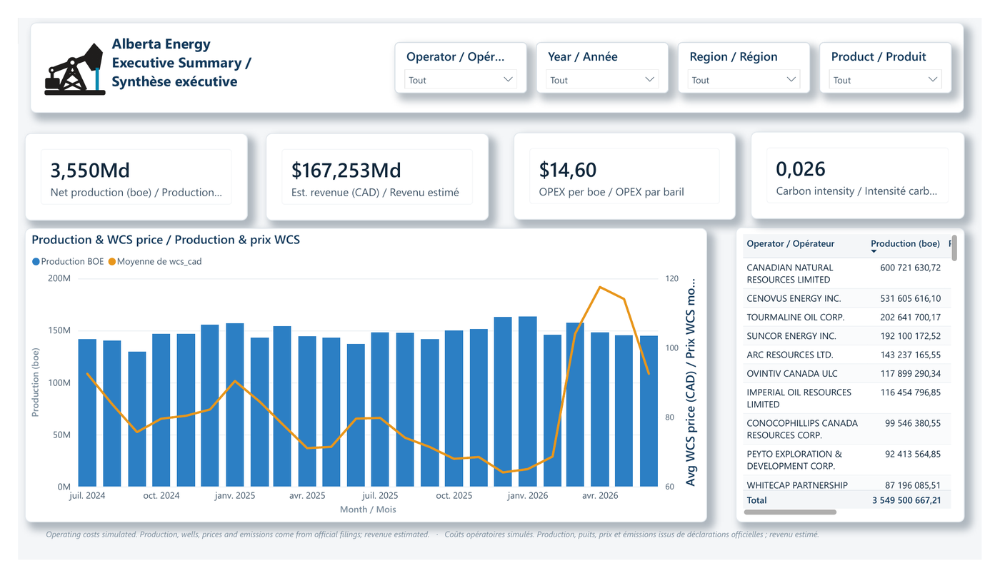
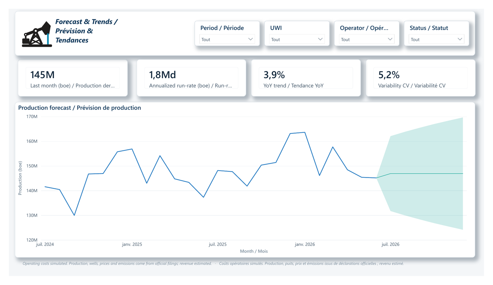
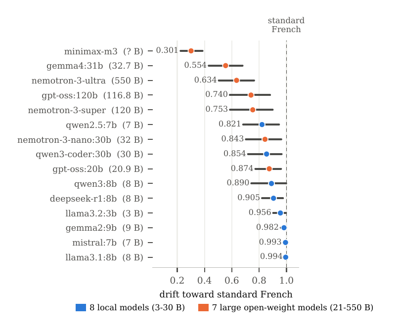
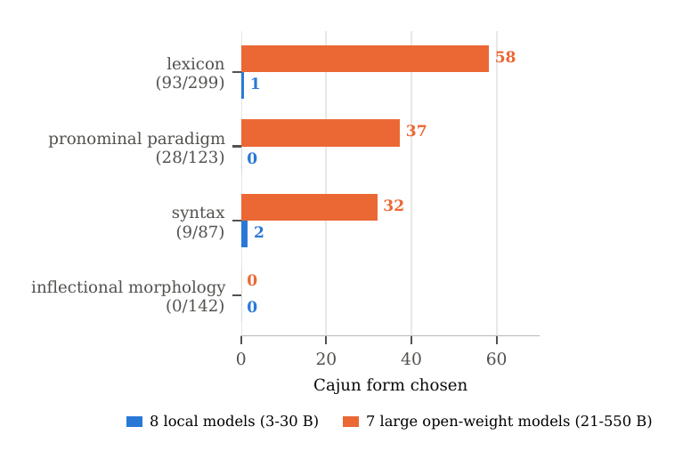
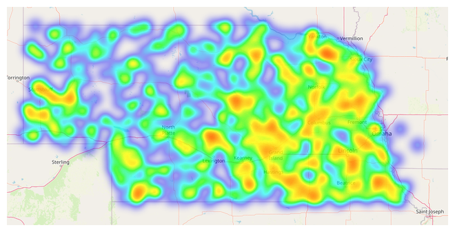
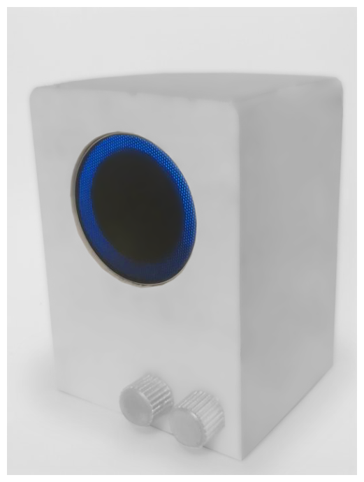

---

## About

Data & BI Analyst with a **Master's in Computer Science** and **2+ years** building clean, scalable datasets and
data pipelines from diverse operational sources across finance, IT and industrial-fleet systems.

- Strong **SQL** and **Power BI**, hands-on **ETL** and **ERP / SAP integration**
- Track record **closing data-quality gaps** across regions and functions
- Turn operational data into **dashboards and KPIs** for technical and non-technical stakeholders
- Detail-oriented, comfortable in high-volume, fast-paced settings
- Bilingual **FR / EN**

  
  
  
  

---

## Skills

<table>
  <tr>
    <td><b>Master&nbsp;Data&nbsp;&amp;&nbsp;Quality</b></td>
    <td>
      
      
      
      
      
      
      
    </td>
  </tr>
  <tr>
    <td><b>Microsoft&nbsp;&amp;&nbsp;BI</b></td>
    <td>
      
      
      
      
      
    </td>
  </tr>
  <tr>
    <td><b>Languages&nbsp;&amp;&nbsp;DB</b></td>
    <td>
      
      
      
      
      
      
      
    </td>
  </tr>
  <tr>
    <td><b>Cloud&nbsp;&amp;&nbsp;Tooling</b></td>
    <td>
      
      
      
      
      
    </td>
  </tr>
  <tr>
    <td><b>ML&nbsp;/&nbsp;AI</b></td>
    <td>
      
      
      
      
      
    </td>
  </tr>
</table>

## Featured Projects

### [Alberta Energy : Operations Intelligence](https://github.com/Nelson-Lefebvre/alberta-energy-bi)

End-to-end analytics on Alberta's oil & gas basin, built entirely from **public data**: Petrinex production
filings, the AER well register, and Government of Alberta / Bank of Canada price series/ingested with
Python, modelled into a **star schema**, and reported in a bilingual **Power BI** model.

<b>Executive summary</b>/KPIs, production vs. WCS price, operator ranking

<b>Forecast &amp; trends</b> / run-rate, YoY trend, variability band

<code>Python</code> · <code>BigQuery</code> · <code>star schema</code> · <code>Power BI</code> · <code>DAX</code> · <code>bilingual reporting</code>

---

### [LLM Dialect Drift Index — Louisiana French](https://github.com/Nelson-Lefebvre/LLM-Dialect-drift-index-Louisiana)

A normalization index for Louisiana French (Cajun): asked for the vernacular form, does a model hold it — or
drift to standard French? **8 linguistic variables, 720 generations, 15 models from 3B to 550B parameters**,
with the full experimental pipeline, prompts, data and statistical analysis published.

<table>
  <tr>
    <td width="50%"></td>
    <td width="50%"></td>
  </tr>
  <tr>
    <td align="center">Drift toward standard French, per model, with confidence intervals</td>
    <td align="center">Cajun form retained by linguistic level — local vs. large models</td>
  </tr>
</table>

<code>Python</code> · <code>experimental design</code> · <code>statistical analysis</code> · <code>NLP evaluation</code> · <code>reproducible research</code>

---

<table>
  <tr>
    <td width="55%" valign="top">

<h4><a href="https://github.com/Nelson-Lefebvre/Artificial-intelligence-application-Storms-in-Nebraska">Nebraska Storm Analysis</a></h4>

Spatial and statistical analysis of <b>70 years of tornado records (1950–2021)</b> to characterise storm
behaviour and support path prediction across Nebraska.

<code>Python</code> · <code>pandas</code> · <code>seaborn</code> · <code>scikit-learn</code> · <code>geospatial</code>

  </td>
    <td width="45%" valign="top">

<h4><a href="https://github.com/Nelson-Lefebvre/Jeanne-AI-FMRADIO-ANALYSER-INTERNSHIP">Jeanne — Offline Voice Assistant</a></h4>

A voice assistant that works with <b>no internet connection</b>, pulling live information from <b>FM radio
waves</b> (TEA5767 + RDS on Raspberry&nbsp;Pi) for remote areas.

<code>Python</code> · <code>Raspberry Pi</code> · <code>speech recognition</code> · <code>signal processing</code>

  </td>
  </tr>
  <tr>
    <td align="center"></td>
    <td align="center"></td>
  </tr>
</table>

---

## Education

| Degree | Institution | Year |
|---|---|---|
| **M.Sc. Computer Science** — Decision-Making, Optimization & AI/Data | Université de Caen Normandie, France | 2021 – 2023 |
| **Exchange Year — M.Sc. Artificial Intelligence** | University of Nebraska at Omaha, USA | 2022 |
| **B.Sc. Computer Science** | Université de Caen Normandie, France | 2018 – 2021 |

### Let's talk !

Open to **Data Analyst** and **Data Engineer** roles in Canada.

